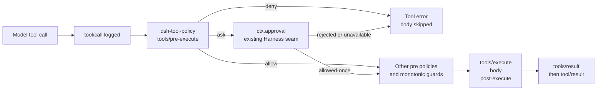

# dsh-tool-policy

Declarative, fail-closed governance for model-requested tools in [DeepSeek Harness](https://github.com/deepseek-ai/deepseek-harness).

> Community plugin. Not affiliated with or maintained by DeepSeek AI.

Repository: [Drifter-yh/dsh-tool-policy](https://github.com/Drifter-yh/dsh-tool-policy)

`dsh-tool-policy` is a small Cordis plugin that evaluates ordered rules at the public `tools/pre-execute` extension point. It can deny a tool call, route it to Harness's existing human approval seam, or delegate it unchanged. It does not replace the Harness approval, sandbox, timeout, retry, telemetry, or session systems.

## Why this is needed

DeepSeek Harness already has strong primitives for tool execution: sandbox policy, one-shot approval, cooperative timeouts, provider retries, repeat-call reminders, and session telemetry. What is missing is a deployment-owned policy layer that applies the same rule vocabulary to every tool, including third-party and MCP tools.

Typical uses include:

- require approval for an entire tool namespace such as `mcp_*`;
- deny a destructive command pattern before the tool body starts;
- run a deny-by-default allowlist for unattended jobs;
- keep sensitive argument values out of policy feedback messages.

The plugin is intentionally not an audit logger or approval implementation. The Harness already owns those seams.

## Installation

After this package is published and the Harness `0.1` packages are available from the configured registry:

```sh
pnpm add dsh-tool-policy @deepseek-ai/cordis @deepseek-ai/dsh-tools
```

The Harness packages are peer dependencies so the host controls the runtime version. `@deepseek-ai/schemastery` is installed as the plugin's normal runtime dependency.

For the current prerelease source checkout, add the plugin as a local Cordis entry and resolve `@deepseek-ai/dsh-tools` from the same Harness checkout. The repository's `demo/` and integration test show that arrangement.

## Quick Start

Add the community plugin to a Cordis composition. This example is explicitly deny-by-default and allows only tools matched by `read_*` unless another rule handles them:

```yaml
- id: tool-policy
  name: 'dsh-tool-policy'
  config:
    defaultDecision: deny
    rules:
      - tool: 'read_*'
        decision: allow
      - tool: 'bash'
        decision: ask
        reason: 'Shell execution requires approval.'
      - tool: 'mcp_*'
        decision: ask
        reason: 'External tool calls require approval.'
      - tool: 'delete_*'
        decision: deny
        reason: 'Delete operations are disabled in this deployment.'
```

The plugin is fail-closed when mounted: the default decision is `deny`, so only explicitly allowed calls run. Set `defaultDecision: allow` only when intentionally deploying a targeted or advisory policy.

## Configuration

```yaml
defaultDecision: deny # deny (default), ask, or allow
rules:
  # First matching rule wins.
  - tool: 'bash'
    decision: deny
    reason: 'Destructive shell commands are disabled.'
    argument:
      path: /command
      contains: 'rm -rf'

  - tool: 'record.update'
    decision: deny
    reason: 'System records are immutable.'
    argument:
      path: /scope
      equals: system

  - tool: 'safe_*'
    decision: allow

  - tool: '*'
    decision: ask
    reason: 'Unlisted tools require approval.'
```

`tool` is an anchored name pattern with one wildcard, `*`. Other regular-expression metacharacters are treated literally. `argument.path` is an RFC 6901 JSON Pointer into parsed tool arguments. A condition uses exactly one of `equals` (JSON scalar equality) or `contains` (non-empty substring on a string). Rule order is explicit and deterministic.

Decision semantics:

- `deny` returns a normal Harness tool error before the body runs;
- `ask` returns `{ kind: 'ask' }` and lets `ctx.approval` decide; without an approval channel Harness fails closed;
- `allow` calls `next()` and therefore does not override a prior or later policy listener;
- `defaultDecision` applies only when no rule matches.

Reasons never interpolate the call arguments. This avoids copying secrets or large payloads into model-visible approval feedback.

## Architecture



The plugin uses only `inject: ['tools']` and `ctx.on('tools/pre-execute', ...)`. Cordis owns listener disposal and reload behavior. The plugin does not patch `ToolRuntime` or `agent-loop`.

## Example

The checked-in demo loads `@deepseek-ai/dsh-system-prompt`, `@deepseek-ai/dsh-tools`, this plugin, and a fixture through the real Cordis Loader. It denies `delete_record` and allows `read_record`; the fixture proves the denied body is never invoked.

```sh
pnpm build
pnpm integration
```

Expected output contains:

```json
{
  "blocked": { "isError": true, "message": "deleting records is disabled in the demo" },
  "allowed": { "isError": false, "value": "record:42" },
  "executed": 1
}
```

## Compatibility with DeepSeek Harness

The plugin targets the Harness `0.1.0-rc.5` API and Cordis `4.0.1`, tested against DeepSeek Harness commit `47f943859bef60e4160492346772ded9b24f765a`. Its Harness-specific code uses the documented `Context`, `tools` service, and `tools/pre-execute` event only. The package declares `@deepseek-ai/dsh-tools` and `@deepseek-ai/cordis` as peer dependencies with a `<0.2.0` / `<5` upper bound so API drift is visible at installation time.

## Current limitations

- Rules are deployment-global; use multiple Cordis contexts if different agents require different policy trees.
- The current Harness `0.1.0-rc.5` packages are not yet on the public npm registry, so this checkout's development-only integration dependencies use local tarballs from the matching Harness source checkout. The published plugin package contains only `dist`, `README.md`, and `LICENSE`, and consumes Harness through peer dependencies.
- Matching supports one condition per rule, JSON Pointer scalar equality, or string containment. It does not implement a general expression language.
- `ask` depends on the Harness approval service and an answerer. The plugin does not provide a UI or automatically approve a request.
- Policy feedback is intentionally argument-free; an operator must inspect the original tool call in the Harness session or telemetry stream.
- The plugin is a pre-dispatch policy, not a hard OS boundary. Use the Harness sandbox for filesystem and process confinement.

## Roadmap

- add an optional policy decision trace through an opt-in plugin-owned observer, without duplicating session audit events;
- add reusable policy presets for common MCP, filesystem, and CI deployments;
- validate compatibility against the first stable Harness `0.1` release and publish a matching package version;
- consider a separate, independently scoped rate-limit plugin if deployments need time-window quotas.

## Development

```sh
pnpm install
pnpm typecheck
pnpm lint
pnpm format:check
pnpm test
pnpm build
pnpm integration
```

The pure matcher is covered by unit tests, the Cordis plugin is exercised through `ToolRuntime`, and `tests/loader.integration.spec.ts` boots the actual Harness Loader composition.

## License

MIT
