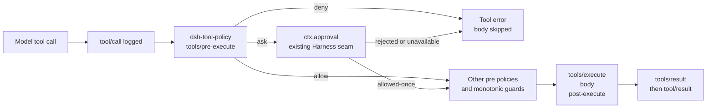

# dsh-tool-policy

[English](README.md) | [简体中文](README.zh-CN.md)

`dsh-tool-policy` 是一个 [DeepSeek Harness](https://github.com/deepseek-ai/deepseek-harness) 工具调用策略插件。它会在工具真正执行之前，根据规则决定这次调用是直接允许（`allow`）、请求人工确认（`ask`），还是拒绝（`deny`）。

它提供一个声明式、默认拒绝（deny-by-default）的策略层，覆盖内置工具、第三方工具和 MCP 工具，并复用 Harness 已有的 approval 和 sandbox 机制。它负责单次调用的策略与路由，不是 capability sandbox。

> 社区插件，与 DeepSeek AI 无隶属关系，也不由其维护。

仓库：[Drifter-yh/dsh-tool-policy](https://github.com/Drifter-yh/dsh-tool-policy)

## 为什么需要它

DeepSeek Harness 已经提供了工具执行所需的基础能力：sandbox policy、一次性 approval、协作式 timeout、provider retry、重复调用提醒以及 session telemetry。缺少的是一个由部署方维护的策略层，用同一套规则覆盖所有工具，包括第三方工具和 MCP 工具。

常见用途包括：

- 允许选定的工具命名空间或工具族，例如 `read_*`；
- 对 MCP 或其他外部工具（例如 `mcp__*`）要求人工确认；
- 在匹配到的工具 body 启动之前，拒绝已知的危险命令模式；
- 为无人值守的 agent 或 job 配置默认拒绝（deny-by-default）的工具调用 allowlist；
- 避免把敏感参数值复制到策略反馈消息中。

典型的调用路径如下：

```text
Agent wants to call a tool
          |
          v
    dsh-tool-policy
          |
   +------+------+
   |      |      |
 allow   ask    deny
   |      |      |
continue Harness stop before
pipeline approval tool body
```

这个插件不是 audit logger，也不实现 approval；这些扩展点由 Harness 自己负责。

## 安全模型

插件针对单次工具调用工作。它会在工具 body 运行之前，匹配可观察到的工具名和可选的参数模式：

- **Harness sandbox — capability enforcement（能力约束）：** 决定 agent 是否根本具备执行某类操作的能力。Harness sandbox 和 runtime isolation 负责约束文件写入或删除、网络访问、进程执行等 capability。
- **dsh-tool-policy — per-call policy / routing（单次调用策略 / 路由）：** 决定这次已知的工具调用应当允许、拒绝还是升级处理。匹配到 `deny` 时，只会阻止这次调用执行，不会撤销底层 capability。
- **Harness Approval — human escalation verdict（人工升级裁决）：** 为被 `ask` 升级的调用提供一次性人工裁决。

一条匹配 shell 参数模式（例如 `rm -rf /foo`）的规则，只约束符合该形状的调用。其他工具或命令序列仍可能产生相同效果。因此，tool policy 与 capability sandbox 是互补层；生产部署应将策略路由与限制性 Harness sandbox 结合使用。

### 它不做什么

`dsh-tool-policy` 不实现 sandboxing、capability enforcement、shell semantic analysis 或 equivalent-operation detection。`deny` 让匹配到的调用不可用，但不意味着一般意义上的破坏性行为变得不可能。它不会重写参数，也不会执行工具 body。

## 安装

当前公开的 Harness package line 是 `0.1.0-rc.6`：

```sh
pnpm add dsh-tool-policy @deepseek-ai/cordis @deepseek-ai/dsh-tools
```

Harness packages 是 peer dependencies，由宿主控制 runtime 版本。`@deepseek-ai/schemastery` 是插件的普通 runtime dependency。上游 source repository 当前在 `master` 报告的版本是 `0.1.0-rc.5`；本 package 针对公开 registry artifacts 中的 `0.1.0-rc.6` 测试。

### 从 GitHub 安装

上游 profile-plugin 文档支持直接从 GitHub 安装 TypeScript bundle：

```sh
dsh plugin --profile my-profile add github:Drifter-yh/dsh-tool-policy#028e2ce4167a88ad32b0c6eec89ee22072189e71
```

Git 安装会拉取 source，因此这个 package 的 `prepare` script 只运行生成 `dist/` 所需的独立 `tsdown` build。如果 pnpm 10 或更新版本报告 `prepare` script 被阻止，请将 package 加入 profile 的 `pnpm-workspace.yaml` build allowlist，然后重试：

```yaml
allowBuilds:
  'dsh-tool-policy@https://codeload.github.com/Drifter-yh/dsh-tool-policy/tar.gz/5d7d4f15781aca9017bf5f420f6fd6bd6b2c0210': true
```

允许安装时执行代码前，请检查并固定 Git commit。`prepare` 不会运行测试，也不依赖 DeepSeek Harness checkout。

本地开发请从 clean clone 使用普通的 package-manager 流程：`pnpm install`。

### Harness profile bundle

这个 package 也遵循 Harness 官方 profile-bundle contract：`package.json` 声明了 `dsh.bundle.patch`，发布包包含 `cordis.patch.yml`。将它安装到 profile：

```sh
dsh plugin --profile my-profile add dsh-tool-policy
```

安装会激活一个 `tool-policy` row，初始配置为 `defaultDecision: deny` 且没有规则。启动 agent 前，在 `$DSH_HOME/profiles/my-profile/cordis.patch.yml` 中配置该 row：

```yaml
- id: tool-policy
  config:
    defaultDecision: deny
    rules:
      - tool: 'read_*'
        decision: allow
      - tool: 'bash'
        decision: ask
        reason: 'Shell execution requires approval.'
```

Harness profile patch 根据 id 定位 row，并替换它的整个 `config`；请重复写出所有希望保留的配置字段。bundle patch 只是组合层：插件仍然可以作为直接的 Cordis entry 使用。

## 快速开始

将社区插件直接加入 Cordis composition。这个示例显式使用 deny-by-default，除非其他规则处理，否则只允许匹配 `read_*` 的工具：

```yaml
- id: tool-policy
  name: 'dsh-tool-policy'
  config:
    defaultDecision: deny
    rules:
      - tool: 'read_*'
        decision: allow
      - tool: 'bash'
        decision: ask
        reason: 'Shell execution requires approval.'
      - tool: 'mcp__*'
        decision: ask
        reason: 'External tool calls require approval.'
      - tool: 'delete_*'
        decision: deny
        reason: 'Delete operations are disabled in this deployment.'
```

插件挂载后，在工具调用层默认采用 fail-closed 行为：默认 decision 是 `deny`，因此只有显式允许的调用会运行。只有在明确要部署 targeted 或 advisory policy 时，才设置 `defaultDecision: allow`。

## 配置

```yaml
defaultDecision: deny # deny (default), ask, or allow
rules:
  # First matching rule wins.
  - tool: 'bash'
    decision: deny
    reason: 'Destructive shell commands are disabled.'
    argument:
      path: /command
      contains: 'rm -rf'

  - tool: 'record.update'
    decision: deny
    reason: 'System records are immutable.'
    argument:
      path: /scope
      equals: system

  - tool: 'safe_*'
    decision: allow

  - tool: '*'
    decision: ask
    reason: 'Unlisted tools require approval.'
```

`tool` 是带一个通配符 `*` 的、锚定完整工具名的模式。其他正则表达式元字符都会按字面处理。`argument.path` 是指向已解析工具参数的 RFC 6901 JSON Pointer。一个 condition 必须在 `equals`（JSON scalar equality）和 `contains`（字符串上的非空 substring）中二选一。规则顺序明确且确定，第一条匹配规则生效。

Decision 的语义如下：

- `deny` 在工具 body 运行之前返回一个普通的 Harness tool error；
- `ask` 返回 `{ kind: 'ask' }`，交给 `ctx.approval` 决定；没有 approval channel 时，Harness 会 fail closed；
- `allow` 调用 `next()`，因此不会覆盖之前或之后的 policy listener；
- `defaultDecision` 只在没有规则匹配时生效。

`reason` 不会插入调用参数。这可以避免把 secret 或大段参数复制到模型可见的 approval feedback 中。

## 架构



插件只使用 `inject: ['tools']` 和 `ctx.on('tools/pre-execute', ...)`。Cordis 负责 listener disposal 和 reload 行为。插件不会 patch `ToolRuntime` 或 `agent-loop`。

## 示例

仓库中已提交的 demo 会通过真正的 Cordis Loader 加载 `@deepseek-ai/dsh-system-prompt`、`@deepseek-ai/dsh-tools`、本插件和一个 fixture。它拒绝 `delete_record`、允许 `read_record`，并验证被拒绝的 body 从未被调用。

```sh
pnpm build
pnpm integration
```

预期输出包含：

```json
{
  "blocked": { "isError": true, "message": "deleting records is disabled in the demo" },
  "allowed": { "isError": false, "value": "record:42" },
  "executed": 1
}
```

## 与 DeepSeek Harness 的兼容性

插件目标 Harness API 范围为 `>=0.1.0-rc.5 <0.2.0`，Cordis 范围为 `>=4.0.1 <5`。当前使用公开的 `0.1.0-rc.6` registry packages 和上游 commit `47f943859bef60e4160492346772ded9b24f765a` 验证。与 Harness 相关的代码只使用文档化的 `Context`、`tools` service 和 `tools/pre-execute` event。peer dependency 的上界会让后续 API 漂移在安装时显现。

package 的 `dsh.bundle.patch` metadata 遵循 Harness profile-bundle specification。`cordis.patch.yml` 按 package name 插入插件，profile composition 会在 profile 自己的 patch 之前应用这一层。bundle 默认 `deny` 且规则列表为空；运行工具前，请在 profile layer 配置插入的 `tool-policy` row。

DeepSeek Harness 将 MCP tools 暴露为 `mcp__<serverName>__<rawName>`，因此 `mcp__*` 规则可以覆盖完整的 MCP namespace。

## 当前限制

- 规则是 deployment-global 的；如果不同 agent 需要不同的 policy tree，请使用多个 Cordis context。
- Harness API 仍处于 prerelease 阶段。公开 registry 当前提供 `0.1.0-rc.6`，其中没有可用的精确 `0.1.0-rc.5` package 版本；peer range 仍从 rc.5 开始，以表示预期的 API boundary，但目前 fresh registry validation 只能针对 rc.6。
- 匹配只支持每条规则一个 condition、JSON Pointer scalar equality 或字符串 containment，不实现通用 expression language。
- `ask` 依赖 Harness approval service 和 answerer。插件不提供 UI，也不会自动批准请求。
- policy feedback 会有意排除参数；操作人员需要在 Harness session 或 telemetry stream 中查看原始工具调用。
- 插件是单次调用的 pre-dispatch policy，不负责 capability enforcement。文件系统、网络和进程隔离应交给 Harness sandbox。

## Roadmap

- 通过可选的、由插件自有的 observer 增加 policy decision trace，但不重复 session audit events；
- 为常见的 MCP、filesystem 和 CI 部署增加可复用的 policy presets；
- 针对首个稳定版 Harness `0.1` release 验证兼容性，并发布匹配的 package version；
- 如果部署需要时间窗口配额，考虑单独设计、独立作用域的 rate-limit plugin。

## 开发与验证

```sh
pnpm install
pnpm typecheck
pnpm lint
pnpm format:check
pnpm test
pnpm build
pnpm integration
```

纯 matcher 由 unit tests 覆盖，Cordis plugin 通过 `ToolRuntime` 验证，`tests/loader.integration.spec.ts` 会启动真实的 Harness Loader composition。

## 社区状态

这是一个由社区维护的 DeepSeek Harness plugin，不隶属于 DeepSeek AI，也不代表 DeepSeek AI 的立场。

## License

MIT
